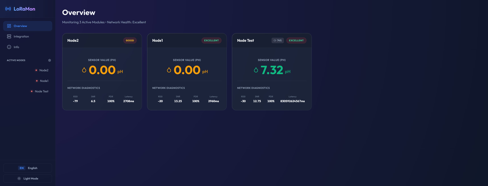

# LoRaWAN Water Quality Monitoring Dashboard

**Name**: Mohamad Rifan Kasyiful Asrar  
**Student ID (NIM)**: 1102223020  
**Major**: S1 Teknik Elektro  
**University**: Telkom University  



## 1. Overview
This repository contains the complete stack for a real-time Water Quality Monitoring Dashboard designed for LoRaWAN IoT networks. It processes incoming sensor data (such as pH and battery levels), routes them through Google Apps Script and a Node.js backend, and visualizes them on a modern React frontend.

- **Frontend**: React application built with Vite, utilizing TailwindCSS/vanilla CSS for styling, Recharts/Chart.js for data visualization, and Socket.io-client for real-time data reception.
- **Backend**: Express.js server acting as a webhook receiver for Google Spreadsheet/LoRaWAN gateway data and a WebSocket server using Socket.io to push real-time updates to the frontend.

## 2. Directory Structure

```text
Dashboard_Backup/
├── backend/               # Node.js Express server
├── frontend/              # React Frontend (Vite)
├── device-integrations/   # Codec, Apps Script, and Arduino INO files
└── README.md              # This documentation file
```

*(Note: For specific code explanations of each folder, please see the respective `README.md` files inside the `frontend/`, `backend/`, and `device-integrations/` directories).*

## 3. Features
- **Universal Integration**: Support for ChirpStack via HTTP Integrations and Google Apps Script.
- **Real-time Metrics**: Live updates for Node Health, Connection Metrics (RSSI/SNR, Latency, PDR), and Sensors.
- **Hardware Ready**: Includes tested C++ LoRaWAN Arduino code and binary payload codecs.
- **Personalization**: Rename nodes, view detailed historical logs, and switch languages.

## 4. How the Data Flows
1. **IoT Node** sends telemetry data to a Gateway (via LoRaWAN).
2. **Gateway/Network Server** (or Google Apps Script) forwards this data via an HTTP POST request to `http://<your-backend-ip>:3000/api/telemetry`.
3. **Backend (`server.js`)** receives the payload, formats it, and broadcasts a `telemetry_update` event via WebSockets.
4. **Frontend (React)** listens for `telemetry_update` and updates the UI charts and device status in real-time.

## 5. Deployment Instructions

### Prerequisites
- Install **Node.js** (v18+ recommended)
- Install **npm** (comes with Node.js)

### Step 1: Deploying the Backend
The backend receives HTTP POST requests (e.g., from your LoRaWAN infrastructure or Google Apps Script webhook) and broadcasts them to the React frontend via WebSocket.

1. Open your terminal and navigate to the backend folder:
   ```bash
   cd backend
   ```
2. Install dependencies:
   ```bash
   npm install
   ```
3. Start the server:
   ```bash
   node server.js
   ```
   *The backend server will run on port `3000` by default (e.g., `http://localhost:3000`). It listens for POST requests at `/api/telemetry`.*

### Step 2: Deploying the Frontend (Development Mode)
To run the dashboard locally for development:

1. Open a **new** terminal window and navigate to the frontend folder:
   ```bash
   cd frontend
   ```
2. Install dependencies:
   ```bash
   npm install
   ```
3. Run the development server:
   ```bash
   npm run dev
   ```
   *The frontend will typically be accessible at `http://localhost:5173`. It will automatically connect to the backend server running on port `3000`.*

### Step 3: Deploying the Frontend (Production)
For deploying to a live web server (like Vercel, Netlify, or an Nginx server):

1. Navigate to the frontend folder:
   ```bash
   cd frontend
   ```
2. Build the production files:
   ```bash
   npm run build
   ```
3. The built static files will be located in the `frontend/dist/` folder. You can serve this folder using any static web server. For a quick local preview, run:
   ```bash
   npm run preview
   ```
